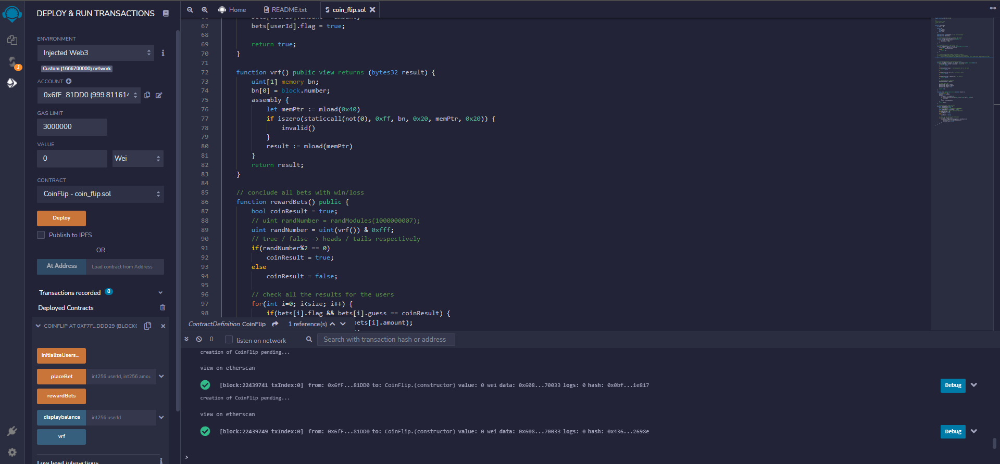
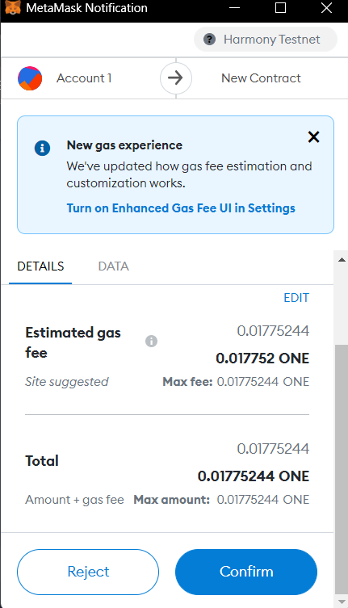

# Solidity_Coin_Flip

## Coin Flip Overview

Testnet deployment address : 0x6fFc9b7890c9F702cD060968D8118B030F181DD0

Steps:
- Initialize all the users with 100 points using initializeUsers().
- Check your balance using displayBalance().
- Place bet (userId, amount, guess) : 0, 20, true
- Click on rewardBets() to see if you have won/lost.
- Again, check your balance.

Few Transactions:

- Wallet - Harmony Testnet   

- Deployed contracts   

- Initialized users   

- Transaction - gas fees   

- Placed bet   

- After clicking on rewardBets() - won the round -> 98 + 2 * 2 = 102   
